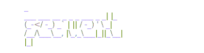
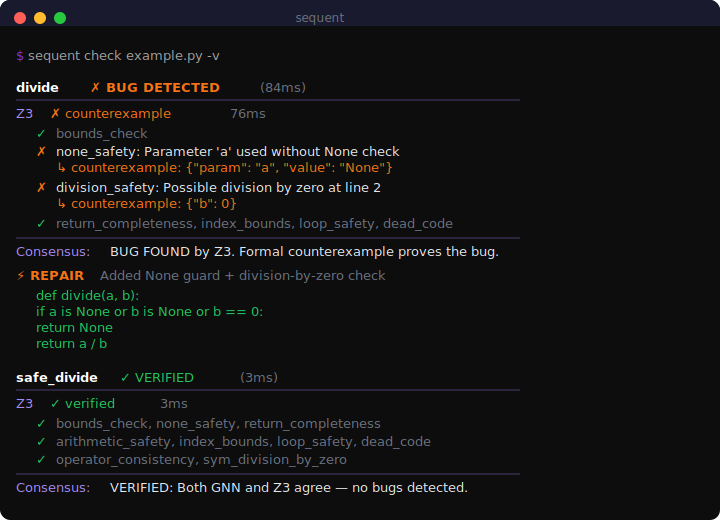

<p align="center">
  
</p>

[](https://github.com/devangpratap/sequent/actions/workflows/ci.yml)
[](https://pypi.org/project/sequent-verify/)
[](https://pypi.org/project/sequent-verify/)
[](https://opensource.org/licenses/MIT)

**Self-learning neurosymbolic code verifier.** 10M params. Runs offline. Free forever.

<p align="center">
  
</p>

Sequent proves your code correct — or finds the exact input that breaks it. A GATv2 graph neural network reads your code's structure, a Z3 SMT solver formally verifies it, and a consensus layer merges both verdicts. It learns from every run, getting sharper the more you use it.

**Python + JavaScript/TypeScript.** No API keys. No cloud. No cost.

## Install

```bash
pip install sequent-verify
```

## Usage

```bash
sequent check main.py                  # verify a file
sequent check main.py -f binary_search # verify one function
sequent check main.py -v               # verbose output + auto-repair
sequent check app.js                   # JS/TS support
sequent check main.py --cert proof.json # export formal proof certificate
sequent watch src/                     # re-verify on save
```

## How it works

```
Source Code → Code Property Graph → GATv2 GNN (10M params) → Bug predictions
                                  → Z3 SMT Solver           → Formal proofs
                                  → Consensus                → Verdict
                                  → Self-Learning            → Gets better
```

1. **GNN proposes** — reads the AST/CFG/data-flow graph and flags suspect nodes
2. **Z3 disposes** — formally verifies 8 property classes, produces counterexamples
3. **Consensus** — both must agree before a verdict is issued
4. **Self-learning** — verification outcomes feed back into GNN training data; accuracy improves with usage

## Benchmark (20 cases: 14 buggy, 6 clean)

| Tool | Bugs found | False positives | Accuracy | Cost | Proof |
|---|---|---|---|---|---|
| **Sequent** | **14/14 (100%)** | 1/6 | **92.5%** | Free | Z3 counterexample |
| Claude Opus 4.6 | 13/14 (92.9%) | 1/6 | 90.0% | ~$0.05/fn | None (natural language) |
| pylint | 0/14 | 0/6 | 30.0% | Free | None |
| pyflakes | 0/14 | 0/6 | 30.0% | Free | None |

Sequent **outperforms Claude Opus 4.6** on bug recall (100% vs 92.9%) while running at **10M params vs 350B+**, fully offline, and free. Claude produces natural-language guesses; Sequent produces **Z3 counterexamples** — formal proofs that the bug exists. Static analyzers can't reason about semantics at all.

> 10M parameters vs 350B+. No API key. No internet. Gets better with every run.

<details>
<summary><strong>Full case-by-case breakdown</strong></summary>

| Category | Case | Bug | Sequent | Opus 4.6 |
|---|---|---|---|---|
| Off-by-one | `binary_search_obo` | `<` vs `<=` | Detected | Detected |
| Off-by-one | `bubble_sort_obo` | Index OOB | Detected | Detected |
| None deref | `find_max_none` | No None check | Detected | Detected |
| None deref | `reverse_string_none` | No None check | Detected | Detected |
| None deref | `sum_list_none` | No None check | Detected | Detected |
| Div-by-zero | `average_no_guard` | Empty list | Detected | Detected |
| Div-by-zero | `normalize_no_guard` | Zero divisor | Detected | Detected |
| Wrong op | `is_even_wrong_op` | `==1` vs `==0` | Detected | Detected |
| Wrong op | `min_of_two_wrong` | Returns max | Detected | Detected |
| Unsafe arith | `factorial_no_guard` | Negative n | Detected | Missed |
| Boundary | `second_largest_no_check` | No len check | Detected | Detected |
| Boundary | `pop_empty` | No empty check | Detected | Detected |
| Mutation | `remove_dupes_mutate` | Mutate while iter | Detected | Detected |
| Logic | `swap_wrong` | Overwrite | Detected | Detected |
| Clean | `binary_search_correct` | — | OK | OK |
| Clean | `find_max_correct` | — | OK | OK |
| Clean | `safe_divide_correct` | — | OK | OK |
| Clean | `fibonacci_correct` | — | OK | OK |
| Clean | `is_palindrome_correct` | — | OK | OK |
| Clean | `gcd_correct` | — | FP | FP |

</details>

## Architecture

| Component | Detail |
|---|---|
| **Model** | GATv2, 8 heads, 256 hidden, 3 layers (~10M params) |
| **Graph** | Code Property Graph = AST + CFG + data flow |
| **Training** | Focal loss + NT-Xent contrastive, Z3 outcomes as supervision |
| **Dataset** | 14,144 synthetic mutations from 164 seed functions |
| **Self-learning** | Verification results auto-collected; periodic fine-tuning |
| **Metrics** | 92.5% acc, 93.3% prec, 100% recall, 96.6% F1 |

## Editor integration

Works with **any** editor via LSP — no extension marketplace needed.

```bash
sequent-lsp              # stdio
sequent-lsp --tcp --port 2087   # TCP
```

<details>
<summary>Neovim / Helix / Emacs / VS Code config</summary>

**Neovim**
```lua
vim.lsp.start({ name = "sequent", cmd = { "sequent-lsp" }, filetypes = { "python", "javascript", "typescript" } })
```

**Helix** (`~/.config/helix/languages.toml`)
```toml
[[language]]
name = "python"
language-servers = ["sequent-lsp"]
[language-server.sequent-lsp]
command = "sequent-lsp"
```

**Emacs**
```elisp
(lsp-register-client
  (make-lsp-client :new-connection (lsp-stdio-connection "sequent-lsp")
                   :major-modes '(python-mode js-mode typescript-mode)
                   :server-id 'sequent))
```

**VS Code / Cursor** — point any generic LSP client at `sequent-lsp`.
</details>

## License

MIT
